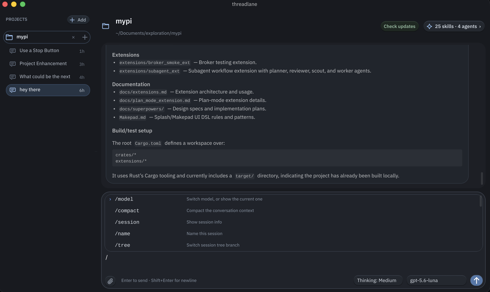
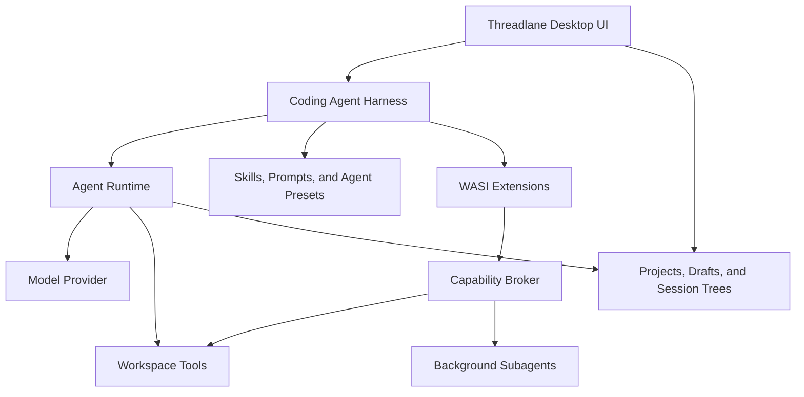

<h1 align="center">
  &nbsp;Threadlane
</h1>

<p align="center">
  A fast, native AI coding workspace built in Rust with Makepad.
</p>

<p align="center">
  <a href="https://github.com/wheregmis/threadlane/actions/workflows/release.yml"></a>
  <a href="https://github.com/wheregmis/threadlane/releases"></a>
  
  
  <a href="#license"></a>
</p>

Threadlane combines a GPU-accelerated desktop interface with a capable coding-agent runtime. It keeps projects, sessions, tools, skills, background agents, and model output in one focused native application—without requiring a browser-based editor shell.

> **Release status:** automated release artifacts currently target Apple Silicon macOS. The Rust workspace can be built from source on hosts supported by its Makepad and native dependency stack.

<p align="center">
  <a href="docs/images/threadlane-workspace.png">
    
  </a>
</p>

<p align="center"><em>Project-aware sessions, streamed coding work, and keyboard-first command discovery in one native workspace.</em></p>

## Why Threadlane?

- **Native and responsive** — a Rust and Makepad interface designed for low-latency streaming and interaction.
- **Workspace-aware** — attach multiple projects, preserve project-local sessions, and switch without losing drafts.
- **Agentic by design** — inspect code, edit files, search repositories, execute commands, and delegate work to subagents.
- **Extensible** — discover skills, prompts, agent presets, and sandboxed WASI extensions from project and user scopes.
- **Durable conversations** — persist sessions as JSONL, branch session trees, generate titles, and compact long contexts.
- **Secure releases** — verify signed update bundles before installation and restrict installation to packaged applications.

## Highlights

| Capability | What it provides |
| --- | --- |
| Native Makepad UI | Streaming chat, Markdown, tool activity, reasoning states, image attachments, keyboard-first controls, and custom GPU shaders. |
| Multi-project workspace | Attached-project registry, project switching, isolated drafts, persistent sessions, archive/delete actions, and automatic titles. |
| Coding tools | Workspace-scoped file reading and writing, directory inspection, pattern search, and bounded command execution. |
| Skills and commands | Global and project-local skill discovery with searchable slash-command completion. |
| Background subagents | Concurrent delegated work with streamed progress events and configurable agent presets. |
| Session trees | Fork, clone, navigate, persist, and compact branching conversation history. |
| Provider integration | OpenAI-compatible streaming, Codex-oriented models, reasoning controls, device authorization, and credential persistence. |
| WASI extensions | Sandboxed Wasm modules using the `threadlane_host` capability broker. |
| Signed updater | Background update checks, verified downloads, progress UI, and packaged-app installation/relaunch. |

## How It Fits Together



## Quick Start

### Prerequisites

- A current stable Rust toolchain.
- The `wasm32-wasip1` Rust target.
- A native C toolchain and the platform dependencies required by Makepad.
- macOS is required for the repository's packaged `.app`/DMG release workflow.

Install the WASI target if needed:

```bash
rustup target add wasm32-wasip1
```

### Build and Run

```bash
git clone https://github.com/wheregmis/threadlane.git
cd threadlane

# Build bundled extensions and deploy their agents/prompts.
./scripts/build_extensions.sh

# Start the native desktop app.
cargo run -p threadlane
```

On first launch, use the in-app authorization flow or provide credentials through the supported provider configuration. Threadlane persists device-flow credentials under `~/.threadlane/auth.json`.

### Basic Workflow

1. Attach or select a project from the sidebar.
2. Create a session or continue an existing project session.
3. Ask Threadlane to inspect, explain, modify, or validate the workspace.
4. Review streamed reasoning summaries and tool activity in the conversation.
5. Use `/` to discover built-in commands, installed skills, and extension commands.
6. Stop an active generation at any time; the submitted draft and attachments are restored when applicable.

## Slash Commands

Type `/` in the composer to open searchable command completion. Use Up/Down to navigate, Enter or Tab to select, and Escape to close.

| Command | Purpose |
| --- | --- |
| `/model` | Switch models or show the current model. |
| `/compact` | Compact the conversation context. |
| `/session` | Show information about the active session. |
| `/name` | Rename the active session. |
| `/tree` | Switch session-tree branches. |
| `/fork` | Fork the active session-tree branch. |
| `/clone` | Clone the active session tree. |
| `/skill` | Load a discovered skill by ID. |
| `/clear-plan` | Clear active plan items. |
| `/quit` | Quit the agent. |

Discovered skills and WASI extension commands are added to completion automatically.

## Projects, Sessions, and Local Data

Threadlane keeps application state local:

- Attached projects: `~/.threadlane/gui/projects.json`
- Provider credentials: `~/.threadlane/auth.json`
- Project sessions: `<project>/.threadlane/sessions/`
- Project extensions, agents, prompts, and skills: `<project>/.threadlane/`
- Global agents and skills: `~/.threadlane/` and `~/.agents/skills/`

Treat these directories as user data. Back them up before manually migrating or removing state.

## Workspace Architecture

| Crate | Responsibility |
| --- | --- |
| [`threadlane`](crates/threadlane) | Makepad desktop application, chat UI, composer, projects, sessions, updater, and application event loop. |
| [`threadlane-coding-agent`](crates/threadlane-coding-agent) | Coding-agent orchestration, project context, skills, prompts, subagents, and WASI extension hosting. |
| [`threadlane-agent`](crates/threadlane-agent) | Agent execution loop, message/session trees, context compaction, hooks, and tool-call dispatch. |
| [`threadlane-provider`](crates/threadlane-provider) | OpenAI-compatible and Codex-oriented streaming clients, model access, and authentication. |
| [`threadlane-tools`](crates/threadlane-tools) | Workspace file operations, search, directory access, and sandboxed process execution. |

The desktop application is further organized by responsibility:

```text
crates/threadlane/src/
├── app/             # App shell, startup, actions, async event polling
├── components/      # Reusable native Makepad components
├── panels/chat/     # Chat, generation, composer, and message presentation
├── panels/sessions/ # Project/session sidebar and persistence
├── state.rs         # Shared application and session state
├── updater.rs       # Signed update lifecycle
└── workspace.rs     # Workspace-local state
```

## Extensions and Skills

Bundled WASI extensions live in `extensions/` and target `wasm32-wasip1`.

```bash
./scripts/build_extensions.sh
```

The script:

1. Compiles every extension crate in release mode.
2. Deploys `.wasm` modules to `.threadlane/extensions/`.
3. Installs bundled agent definitions into `.threadlane/agents/`.
4. Installs bundled prompts into `.threadlane/prompts/`.
5. Fails if an expected module or associated resource cannot be deployed.

Extensions import `threadlane_host.request` and receive only the capabilities exposed through Threadlane's broker. Skill and agent discovery supports project-local and global scopes.

## Development

Run commands from the repository root.

```bash
# Fast desktop-app validation
cargo check -p threadlane

# Focused updater tests
cargo test -p threadlane updater::tests

# Full workspace test suite
cargo test --workspace

# Patch whitespace validation
git diff --check

# Run the desktop app
cargo run -p threadlane
```

For repository-specific coding and Makepad conventions, see [`AGENTS.md`](AGENTS.md). The UI reference and Splash/Makepad notes are in [`Makepad.md`](Makepad.md).

## Packaging and Releases

Threadlane uses [`cargo-packager`](https://github.com/crabnebula-dev/cargo-packager) and [`robius-packaging-commands`](https://github.com/project-robius/robius-packaging-commands) for desktop packaging.

### Package Locally

Install the packaging tools:

```bash
cargo install --locked cargo-packager --version 0.11.8
cargo install --locked --git https://github.com/project-robius/robius-packaging-commands.git
```

Build extensions, compile the release binary, and package the application:

```bash
./scripts/build_extensions.sh
cargo build --release --bin threadlane
cargo packager --release --manifest-path crates/threadlane/Cargo.toml
```

Generated packages are placed in `crates/threadlane/dist/`.

### Signed Application Updates

Threadlane uses [`cargo-packager-updater`](https://crates.io/crates/cargo-packager-updater) to check, download, verify, install, and relaunch signed macOS updates. It checks automatically in the background on every launch. The Projects sidebar remains unchanged when the application is current or the check cannot complete; an update action appears only when a newer signed release is available.

Generate the updater key pair once and retain the same key for future releases:

```bash
cargo packager signer generate \
  --path threadlane-updater.key \
  --password 'a-strong-password'
```

The generated private material is ignored by Git. Configure GitHub Actions without committing it:

```bash
gh variable set THREADLANE_UPDATER_PUBLIC_KEY < threadlane-updater.key.pub
gh secret set CARGO_PACKAGER_SIGN_PRIVATE_KEY < threadlane-updater.key
gh secret set CARGO_PACKAGER_SIGN_PRIVATE_KEY_PASSWORD
```

Release builds embed `THREADLANE_UPDATER_PUBLIC_KEY`. The private key is available only to the release workflow and signs `Threadlane.app.tar.gz`. Existing installations reject updates whose signatures do not match the embedded public key. Do not rotate or lose the private key without an explicit migration plan.

#### Test the Updater UI

A development run automatically checks the published manifest on launch and can exercise signature verification, downloads, and the complete updater UI:

```bash
THREADLANE_UPDATER_PUBLIC_KEY="$(cat threadlane-updater.key.pub)" \
cargo run -p threadlane
```

Installation and relaunch remain restricted to a packaged `.app`, so a development run cannot replace `target/debug`.

#### Test an Unpublished Update

Override the manifest endpoint at compile time:

```bash
export THREADLANE_UPDATER_PUBLIC_KEY="$(cat threadlane-updater.key.pub)"
export THREADLANE_UPDATER_ENDPOINT="http://127.0.0.1:8787/latest.json"
```

Build and preserve the lower-version application, then increase the version in `crates/threadlane/Cargo.toml` and create a signed update archive:

```bash
./scripts/build_extensions.sh
cargo build --release --bin threadlane
cargo packager --release --formats app \
  --manifest-path crates/threadlane/Cargo.toml

mkdir -p "$HOME/Applications"
rm -rf "$HOME/Applications/Threadlane Test.app"
cp -R crates/threadlane/dist/Threadlane.app \
  "$HOME/Applications/Threadlane Test.app"

# Increase the threadlane package version before continuing.
rm -f crates/threadlane/dist/Threadlane.app.tar.gz*
cargo build --release --bin threadlane
CARGO_PACKAGER_SIGN_PRIVATE_KEY=threadlane-updater.key \
CARGO_PACKAGER_SIGN_PRIVATE_KEY_PASSWORD='your-key-password' \
  cargo packager --release --formats app \
  --manifest-path crates/threadlane/Cargo.toml
```

Create `crates/threadlane/dist/latest.json` using the higher test version and generated signature:

```bash
TEST_VERSION=0.0.7
jq -n \
  --arg version "$TEST_VERSION" \
  --arg signature "$(cat crates/threadlane/dist/Threadlane.app.tar.gz.sig)" \
  '{
    version: $version,
    platforms: {
      "macos-aarch64": {
        url: "http://127.0.0.1:8787/Threadlane.app.tar.gz",
        signature: $signature,
        format: "app"
      }
    }
  }' > crates/threadlane/dist/latest.json

python3 -m http.server 8787 --directory crates/threadlane/dist
```

While the server is running, start Threadlane in another terminal to test check/download behavior:

```bash
cargo run -p threadlane
```

Open `$HOME/Applications/Threadlane Test.app` instead to test the complete installation and relaunch flow. Restore the intended package version and unset `THREADLANE_UPDATER_ENDPOINT` afterward.

### Automated macOS Releases

The release workflow is defined in [`.github/workflows/release.yml`](.github/workflows/release.yml). A release tag must exactly match the version in `crates/threadlane/Cargo.toml`:

```bash
git tag v0.1.0
git push origin v0.1.0
```

A tagged build publishes:

- A user-facing DMG.
- A signed `.app.tar.gz` updater bundle.
- The updater signature.
- A `latest.json` update manifest.

### macOS Gatekeeper Note

Release bundles currently use an ad-hoc macOS code signature. This preserves bundle integrity but does not establish Apple notarization or Gatekeeper trust. A trusted downloaded artifact may need approval in **System Settings → Privacy & Security** or explicit quarantine removal:

```bash
xattr -dr com.apple.quarantine /Applications/Threadlane.app
```

Only bypass quarantine for an artifact you trust. The release workflow verifies the app and DMG structure before publishing, while the updater signature separately authenticates automatic updates.

## Security

- Never commit updater private keys, signing passwords, provider tokens, or local credential files.
- Workspace tools enforce project-root containment and command timeout boundaries.
- WASI extensions receive brokered capabilities instead of unrestricted host access.
- Review extension manifests, skills, prompts, and agent presets before installing third-party content.
- Report security-sensitive issues privately to the maintainers rather than publishing credentials or exploit details in an issue.

## Documentation

- [`AGENTS.md`](AGENTS.md) — repository conventions for coding agents and contributors.
- [`Makepad.md`](Makepad.md) — Makepad and Splash DSL reference notes.
- [`crates/threadlane/README.md`](crates/threadlane/README.md) — desktop application overview.
- [`crates/threadlane-agent/README.md`](crates/threadlane-agent/README.md) — core agent runtime.
- [`crates/threadlane-coding-agent/README.md`](crates/threadlane-coding-agent/README.md) — coding-agent harness and extensions.
- [`crates/threadlane-provider/README.md`](crates/threadlane-provider/README.md) — provider and authentication layer.
- [`crates/threadlane-tools/README.md`](crates/threadlane-tools/README.md) — workspace tool primitives.

## Contributing

Focused contributions are welcome. Before opening a pull request:

1. Keep changes scoped and consistent with existing architecture.
2. Add or update tests for behavior changes.
3. Run the narrowest relevant checks, followed by `cargo check -p threadlane` and `git diff --check` for desktop UI changes.
4. Run `cargo test --workspace` when the change affects shared crates or runtime behavior.
5. Document new workflows, limitations, or durable Makepad lessons in `README.md` or `AGENTS.md` as appropriate.

## License

Threadlane is available under the MIT License.
