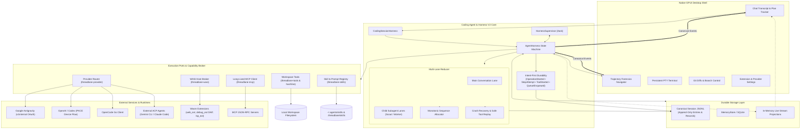

<h1 align="center">
  &nbsp;Threadlane
</h1>

<p align="center">
  A fast, native AI coding workspace built in Rust with GPUI.
</p>

<p align="center">
  <a href="https://github.com/wheregmis/threadlane/actions/workflows/release.yml"></a>
  <a href="https://github.com/wheregmis/threadlane/releases"></a>
  
  
  <a href="#license"></a>
</p>

Threadlane combines a GPU-accelerated desktop interface with a high-performance coding agent runtime. It brings multi-project workspaces, persistent multi-lane conversation trees, intent-first durable execution, sandboxed WASI extensions, MCP integrations, and external ACP agents together into a single focused, native application.

> **Release status:** Automated release packages target Apple Silicon macOS (`.dmg`, `.app.tar.gz`) and Ubuntu 24.04 x86_64 (`.deb`). Can also be built from source on other platforms supported by GPUI.

<p align="center">
  <a href="assets/images/threadlane-workspace.png">
    
  </a>
</p>

<p align="center"><em>Native GPUI workspace featuring project-aware sessions, persistent PTY terminals, streamed agent operations, and keyboard-first command discovery.</em></p>

---

## Why Threadlane?

- **Native & Ultra-Responsive** — Built from the ground up in Rust using GPUI for sub-millisecond input handling, smooth 120 FPS rendering, and instant streaming.
- **Harness V2 Durable Runtime** — Intent-first state machine with multi-lane reducer, deterministic crash/interruption recovery, monotonic sequence accounting, and append-only JSONL storage.
- **Provider-Neutral Routing** — Unified streaming support for Google Antigravity (Cloud Code Assist), OpenAI / Codex, OpenCode, and external Agent Client Protocol (ACP) agents.
- **Precision Workspace Tools** — Workspace-contained file ops, AST/ripgrep pattern search, sandboxed execution, and drift-resistant `line:hash` anchor edits via `threadlane-hashline`.
- **Extensible Sandbox** — Sandboxed WebAssembly (WASI) extensions brokered via `threadlane_host`, long-lived MCP servers, and dynamic SKILL.md discovery.
- **Session-Scoped Plans & Trajectory** — Model-managed persistent todo plans alongside an interactive canonical Trajectory inspector for fine-grained execution forensics.
- **Integrated Persistent PTY** — Full interactive terminal emulation (`portable-pty` + `vt100`) grouped per project workspace.
- **Signed Auto-Updates** — Background update checks with cryptographic signature validation and in-app relaunch on macOS.

---

## Architecture: Harness V2

Threadlane's architecture centers around the **Harness V2** runtime: an intent-first, multi-lane state machine that decouples the user interface from agent orchestration, provider communication, and tool execution while guaranteeing durable crash recovery and replay safety.


```mermaid
flowchart TD
    subgraph UI["Native GPUI Desktop Shell"]
        ChatView["Chat Transcript & Plan Tracker"]
        TrajectoryView["Trajectory Forensics Navigator"]
        PtyTerm["Persistent PTY Terminal"]
        GitPanel["Git Diffs & Branch Control"]
        SettingsView["Extension & Provider Settings"]
    end

    subgraph Harness["Coding Agent & Harness V2 Core"]
        CSH["CodingSessionHarness"]
        Supervisor["HarnessSupervisor (/task)"]
        AgentHarness["AgentHarness State Machine"]

        subgraph Reducer["Multi-Lane Reducer"]
            MainLane["Main Conversation Lane"]
            SubLanes["Child Subagent Lanes (Scout / Worker)"]
            SeqAlloc["Monotonic Sequence Allocator"]
            Recovery["Crash Recovery & Safe Tool Replay"]
        end

        IntentLog["Intent-First Durability\n(OperationStarted • StepAttempt • ToolStarted • QueueEnqueued)"]
    end

    subgraph Store["Durable Storage Layer"]
        JSONL["Canonical Session JSONL\n(Append-Only Entries & Records)"]
        MemStore["MemoryStore / SQLite"]
        Snapshots["In-Memory Live Stream Projections"]
    end

    subgraph Ports["Execution Ports & Capability Broker"]
        ProviderRouter["Provider Router (threadlane-provider)"]
        ToolsEngine["Workspace Tools (threadlane-tools & hashline)"]
        McpEngine["Long-Lived MCP Client (threadlane-mcp)"]
        WasiBroker["WASI Host Broker (threadlane-wasi)"]
        SkillScanner["Skill & Prompt Registry (threadlane-skills)"]
    end

    subgraph Backends["External Services & Runtimes"]
        Antigravity["Google Antigravity (v1internal OAuth)"]
        OpenAI["OpenAI / Codex (PKCE Device Flow)"]
        OpenCode["OpenCode Go Client"]
        AcpAgents["External ACP Agents (Gemini CLI / Claude Code)"]
        WasiModules["Wasm Extensions (web_ext, debug_ext DAP, lsp_ext)"]
        McpServers["MCP JSON-RPC Servers"]
    end

    %% UI Connections
    ChatView <--> CSH
    TrajectoryView <--> AgentHarness
    Supervisor <--> AgentHarness
    CSH --> AgentHarness

    %% Harness Internal Connections
    AgentHarness --> Reducer
    AgentHarness --> IntentLog
    Reducer --> SeqAlloc
    Reducer --> Recovery

    %% Storage Connections
    AgentHarness <--> Store
    IntentLog --> JSONL
    Reducer --> JSONL
    AgentHarness -.-> Snapshots
    Snapshots -.-> ChatView

    %% Ports Connections
    AgentHarness --> Ports
    ProviderRouter --> Antigravity & OpenAI & OpenCode & AcpAgents
    ToolsEngine --> WorkspaceFS[(Local Workspace Filesystem)]
    McpEngine --> McpServers
    WasiBroker --> WasiModules
    SkillScanner --> SkillFiles[(~/.agents/skills & .threadlane/skills)]

    %% Event dispatch back to UI
    AgentHarness == Canonical Events ==> ChatView & TrajectoryView
```

### Core Architecture Invariants

1. **Intent-First Durability:** Durable records (`OperationStarted`, `StepAttempt`, `ToolStarted`, `QueueEnqueued`) are written to canonical JSONL *before* dispatching provider or physical tool actions.
2. **Multi-Lane Execution:** Foreground chat runs in `main`, while delegated subagents (`scout`, `worker`) execute in dedicated child lanes keyed by deterministic parent session + tool call ID.
3. **Safe Replay & Crash Recovery:** Reopening a session reduces persisted records without side effects. Interrupted tools with matching declarations replay safely; unfinished unverified operations synthesize interrupted results without corrupting state.
4. **Append-Only Ledger:** Sequence numbers and usage accounting (tokens, provider queries, physical tool operations) are monotonic and reduced from immutable historical records.

---

## Highlights & Capabilities

| Capability | What It Provides |
| --- | --- |
| **Native GPUI Desktop UI** | Streaming markdown, rich syntax-highlighted diffs, tool activity widgets, reasoning/thinking dropdowns, image attachments, keyboard shortcuts, and split-screen layouts. |
| **Multi-Project Workspace** | Attach and switch between multiple repositories; project-scoped sessions, drafts, skill configurations, and persistent PTY terminal groups. |
| **Trajectory Inspector** | Forensic execution view showing raw canonical entries, step attempts, retries, multi-lane subagent streams, and tool correlation metadata. |
| **Session-Scoped Plan Tracker** | Model-controlled todo lists persisted in `session_plan` records, rendered above the composer without leaking across global tasks. |
| **Multi-Provider Routing** | First-class routing for Google Antigravity (`antigravity/`), OpenAI / Codex (PKCE device login), OpenCode (`opencode-go/`), and ACP agents (`acp/`). |
| **External ACP Agents** | Run third-party Agent Client Protocol agents (e.g. Gemini CLI, Claude Code) over stdio with full UI event streaming. |
| **Precision File Editing** | Drift-resistant line replacement using `threadlane-hashline` line:hash anchors, preventing collision during multi-turn refactors. |
| **Sandboxed WASI Extensions** | WebAssembly extensions for web search (`web_ext`), interactive DAP debugging (`debug_ext`), LSP assistance (`lsp_ext`), and custom tools. |
| **Model Context Protocol (MCP)** | High-performance, long-lived JSON-RPC MCP server connections with concurrent tool dispatch and automatic session recovery. |
| **Integrated Git & Diff Viewer** | Staged/unstaged file navigation, interactive diff viewer, one-click commit message generation, and GitHub PR compare links. |
| **Signed Auto-Updates** | In-app background checks, Ed25519 signature verification, download progress, and restart-to-update on macOS. |

---

## Quick Start

### Prerequisites

- Rust 1.95.0 or later (the repository pins 1.95.0 automatically through
  `rust-toolchain.toml`; install it with `rustup toolchain install 1.95.0`).
- WebAssembly target: `rustup target add wasm32-wasip1`.
- Native C toolchain (standard Xcode Command Line Tools on macOS; `build-essential` on Ubuntu).

### Build & Run

```bash
# Clone the repository
git clone https://github.com/wheregmis/threadlane.git
cd threadlane

# Build bundled WASI extensions (web_ext, debug_ext, lsp_ext, etc.)
./scripts/build_extensions.sh

# Run the native GPUI desktop application
# macOS: the app must run from a bundle, so use the dev-run script
./scripts/run-gpui-macos.sh

# Linux / other platforms
cargo run -p threadlane-gpui
```

> **macOS:** `cargo run -p threadlane-gpui` aborts with `bundleProxyForCurrentProcess is nil`.
> Startup reaches `UNUserNotificationCenter`, which macOS refuses to hand to a process that is
> not inside an app bundle. `./scripts/run-gpui-macos.sh` builds the same binary, wraps it in
> `target/debug/Threadlane-dev.app`, and runs it in the foreground, so `RUST_LOG`, stdout, and
> Ctrl-C behave as usual. Pass `--release` for a release build.

### Provider Authentication

Threadlane supports multiple provider backends:

- **Google Antigravity:** Supports Antigravity OAuth credentials with automatic Cloud Code Assist endpoint discovery.
- **OpenAI / Codex:** Use the built-in PKCE device authorization flow (`~/.threadlane/auth.json`) or configure your API key in Settings.
- **External ACP Agents:** Configure binaries in `~/.threadlane/acp.json` or `<project>/.threadlane/acp.json`,
  or from Settings → ACP Agents. The agent signs itself in, so no Threadlane provider credential is needed.
  Select it afterwards from the model picker or `/model` as `acp/<id>`.

  ```jsonc
  // ~/.threadlane/acp.json
  {
    "agents": [
      {
        "id": "claude_code",
        "name": "Claude Code",
        // An app launched from Finder inherits no shell PATH, so a
        // version-manager binary such as npx needs an absolute path here.
        "command": "/usr/local/bin/npx",
        "args": ["-y", "@agentclientprotocol/claude-agent-acp"],
        "enabled": true
      },
      {
        "id": "gemini",
        "name": "Gemini CLI",
        "command": "gemini",
        "args": ["--experimental-acp"],
        "enabled": true
      }
    ]
  }
  ```

  Claude Code uses the credentials of the `claude` CLI; run `claude /login` once if it reports that
  sign-in is required. Project entries shadow global entries sharing an `id`, and `scope` is always
  taken from the file an entry was read from rather than from the entry itself.

### Structured Logging

Control console verbosity at launch using `RUST_LOG`:

```bash
# Debug logging (the macOS development launcher defaults to debug)
./scripts/run-gpui-macos.sh

# Restart the development daemon so its logs use this terminal
./scripts/run-gpui-macos.sh --restart-daemon

# Quiet development run
RUST_LOG=info ./scripts/run-gpui-macos.sh

# Debug logging for harness events, revision bumps, and UI state
RUST_LOG=threadlane_gpui=debug ./scripts/run-gpui-macos.sh

# Deep trace of agent execution loops & harness records
RUST_LOG=threadlane_gpui=debug,threadlane_agent=trace ./scripts/run-gpui-macos.sh

# GPUI frame-time overlay (current, slowest 1%/10%, max, and frame count)
THREADLANE_GPUI_PROFILE=1 cargo run -p threadlane-gpui --features gpui-profiler
```

The macOS development launcher also inherits the daemon's stdout/stderr, so OAuth exchange errors are visible in the same terminal. Use `--restart-daemon` when a daemon from an earlier run is still active; it only stops a daemon launched from the development bundle and refuses to stop another daemon.

On Linux, substitute `cargo run -p threadlane-gpui` for the script in each of the above.

---

## Slash Commands

Type `/` in the composer to activate command completion:

| Command | Description |
| --- | --- |
| `/model` | Inspect or switch the active model / ACP agent. |
| `/compact` | Compact the active context window while preserving session summaries. |
| `/session` | View active session details, token usage, and lane stats. |
| `/name` | Rename the current session. |
| `/tree` | Navigate branching conversation history. |
| `/fork` | Fork the conversation into a new independent branch. |
| `/clone` | Clone the current session tree. |
| `/skill` | Manually load and activate a discovered skill. |
| `/task` | Launch an autonomous background supervisor task. |
| `/quit` | Exit the application. |

*Discovered skills and WASI extension commands are automatically indexed into slash completion.*

---

## Repository Map

The Threadlane workspace is modularized into focused crates:

| Crate | Path | Responsibility |
| --- | --- | --- |
| `threadlane-gpui` | [`crates/threadlane-gpui`](crates/threadlane-gpui) | Native GPUI desktop application, view hierarchy, PTY terminal, and UI event loops. |
| `threadlane-session` | [`crates/threadlane-session`](crates/threadlane-session) | Coding agent orchestration, `CodingSessionHarness`, supervisor, subagents, and ACP engine. |
| `threadlane-runtime` | [`crates/threadlane-runtime`](crates/threadlane-runtime) | Core agent loop, `AgentHarness` V2 state machine, multi-lane reducer, and session trees. |
| `threadlane-provider` | [`crates/threadlane-provider`](crates/threadlane-provider) | Multi-provider routing (Antigravity, OpenAI/Codex, OpenCode) and streaming parsers. |
| `threadlane-tools` | [`crates/threadlane-tools`](crates/threadlane-tools) | Workspace-contained file tools, ripgrep search, and sandboxed process execution. |
| `threadlane-hashline` | [`crates/threadlane-hashline`](crates/threadlane-hashline) | High-precision `line:hash` anchor calculation and drift-proof text editing. |
| `threadlane-mcp` | [`crates/threadlane-mcp`](crates/threadlane-mcp) | Long-lived Model Context Protocol (MCP) JSON-RPC client and tool executor. |
| `threadlane-skills` | [`crates/threadlane-skills`](crates/threadlane-skills) | SKILL.md discovery, YAML frontmatter parsing, and project skill filtering. |
| `threadlane-wasi` | [`crates/threadlane-wasi`](crates/threadlane-wasi) | WebAssembly (WASI) runtime and `threadlane_host` capability broker. |
| `threadlane-git` | [`crates/threadlane-git`](crates/threadlane-git) | Git status inspection, branch checkout, diff generation, and worktree helpers. |
| `threadlane-auth` | [`crates/threadlane-auth`](crates/threadlane-auth) | Trait-based credential storage and OAuth PKCE device flows. |
| `threadlane-updater` | [`crates/threadlane-updater`](crates/threadlane-updater) | Signed update discovery, verified bundle downloads, and packaged app relaunch. |

---

## Extensions & Debugging

Threadlane bundles sandboxed WASI extensions located in `extensions/`:

- **`web_ext`**: Sandboxed HTTP client (`fetch`) and DuckDuckGo search (`web_search`) governed by permission prompts (`.threadlane/permissions.json`).
- **`debug_ext`**: Debug Adapter Protocol (DAP) client enabling the agent to set breakpoints, step through code, inspect variables, and evaluate stack traces via `lldb-dap`, `debugpy`, `dlv dap`, or `js-debug-adapter`.
- **`lsp_ext`**: Language Server Protocol bridge for real-time diagnostics and code intelligence.
- **`goal_ext`**: Goal decomposition and autonomous objective tracking.

To build and package all extensions:
```bash
./scripts/build_extensions.sh
```

---

## Development & Verification

Follow the standard validation pipeline before submitting changes:

```bash
# Fast desktop application check
cargo check -p threadlane-gpui

# Check patch whitespace
git diff --check

# Focused crate tests
cargo test -p threadlane-runtime
cargo test -p threadlane-session
cargo test -p threadlane-updater

# Full workspace test suite
cargo test --workspace
```

For coding agent rules and repository conventions, consult [`AGENTS.md`](AGENTS.md).

---

## Packaging & Releases

Threadlane utilizes `cargo-packager` and GitHub Actions for continuous delivery:

```bash
# Install packaging toolchain
cargo install --locked cargo-packager --version 0.11.8
cargo install --locked --git https://github.com/project-robius/robius-packaging-commands.git

# Package release binary
./scripts/build_extensions.sh
cargo build --release --bin threadlane-gpui
cargo packager --release --manifest-path crates/threadlane-gpui/Cargo.toml
```

Updates are cryptographically signed using Ed25519 keys via `cargo-packager-updater` and published automatically via [Release Please](https://github.com/googleapis/release-please).

---

## License

Threadlane is open-source software licensed under the [MIT License](LICENSE).
